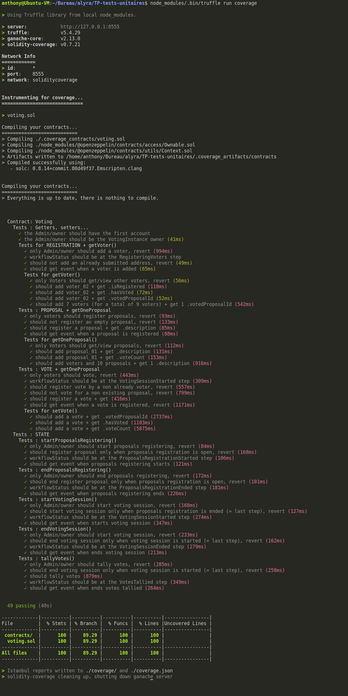
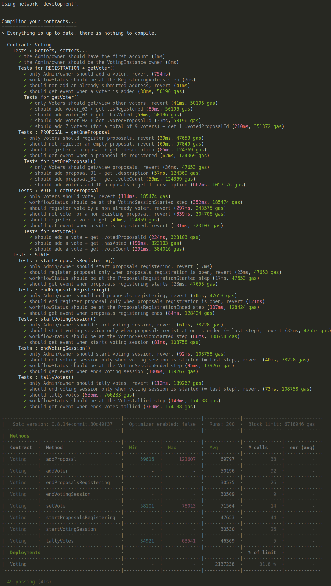

# TP n°2 : Tests unitaires

## _Préambule_

J'ai choisi de tester le fichier voting.sol entier car je souhaitais connaître le résultat avec l'outils "Solidity-Coverage" et également pour avoir votre correction de développeurs professionnels.

## Introduction

Les tests unitaires de ce TP portent sur le fichier voting.sol tel que je l'ai téléchargé sur le Google drive d'Alyra.
Les tests sont dans quasimment le même ordre que celui du fichier du développeur de "voting.sol".

Ces fonctions ont été testés :

**Contract: Voting**

- 28 Tests Getters, setters... dont :
  - 1 test pour vérifier que l'administrateur possède bien le 1er compte.
  - 1 test pour vérifier que l'administrateur est le propriétaire de l'instance
  - 10 Tests pour REGISTRATION + getVoter()
    - dont 5 Tests pour getVoter()
  - 9 Tests : PROPOSAL + getOneProposal
    - dont 4 Tests pour getOneProposal()
  - 10 Tests : VOTE + getOneProposal
    - dont 3 Tests pour setVote()
- 21 Tests STATE dont :
  - 4 Tests sur startProposalsRegistering()
  - 4 Tests sur endProposalsRegistering()
  - 4 Tests sur startVotingSession()
  - 4 test sur endVotingSession()
  - 5 Tests sur tallyVotes()

**52 tests unitaires au total.**

D'autres tests ont aussi été réalisés avec les outils **"eth-gas-reporter"** et **"solidity-coverage"**.
Les 2 images ci-dessous montrent les résultats.

## Test Coverage

## Test eth-gas-reporter

